# Image Uploader

A simple blog CMS platform built with the **VILT** stack. Open source and designed as a showcase of my current full-stack skills as well as provide a demo for using the stack.

> If you're interesting in developing an application using VILT, check out my [vilt stack starter kit](https://github.com/DignitySAMP/vilt-stack).

---

## 📦 Stack

- **Laravel** 12.x  
- **Inertia.js** 2.x  
- **Vue** 3.x (Composition API)  
- **Tailwind CSS** 4.x  


## 📦 Dependencies

- **Spatie Laravel Permissions** – Permission and role system  
- **Ziggy.js** – Laravel route access in Vue  


## 🔧 Setup

Install dependencies:

```bash
npm install && composer install
cp .env.example .env
php artisan key:generate
```

Run database setup:

```bash
php artisan migrate # type 'yes' when prompted to create database.sqlite
php artisan db:seed # seeds mock data and test user
```

Link storage:
```bash
php artisan storage:link
```


## ✨ Screenshots

<details>
  <summary>Click to view screenshots</summary>
  <br>
    <p align="center">
        Authentication and e-mail template preview
    </p>
    <p align="center">
        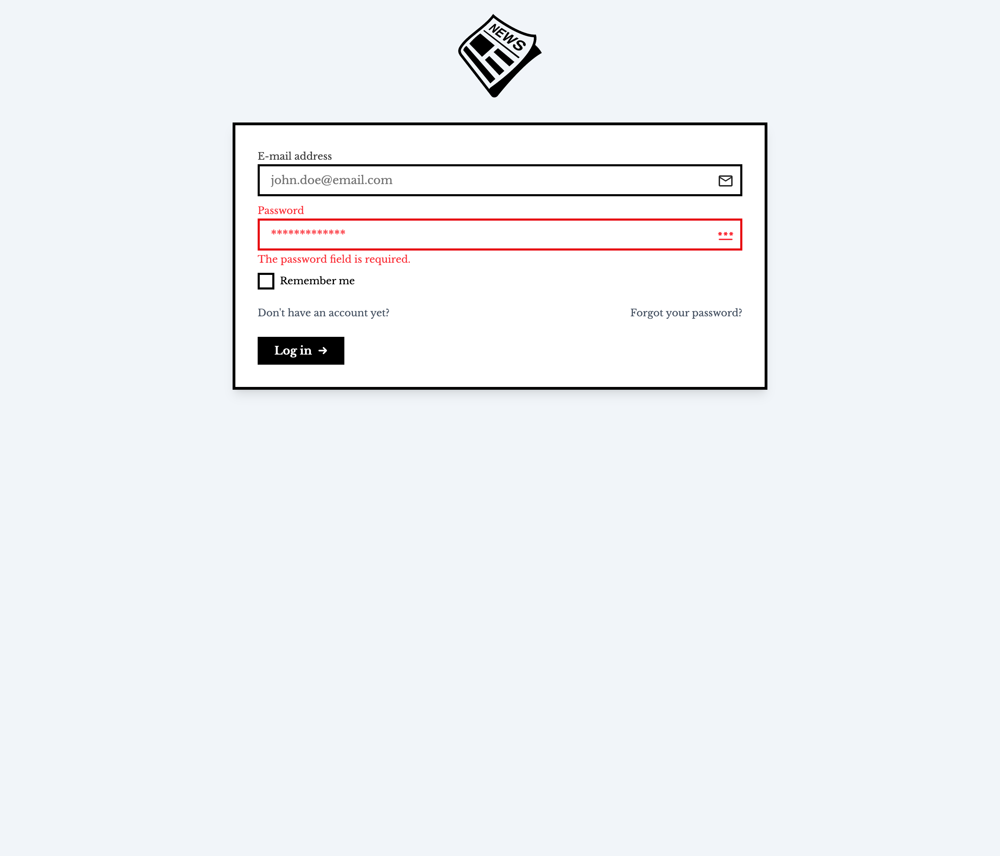
        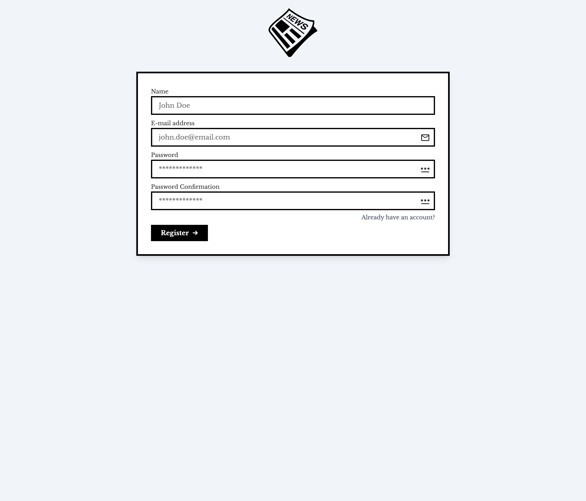
        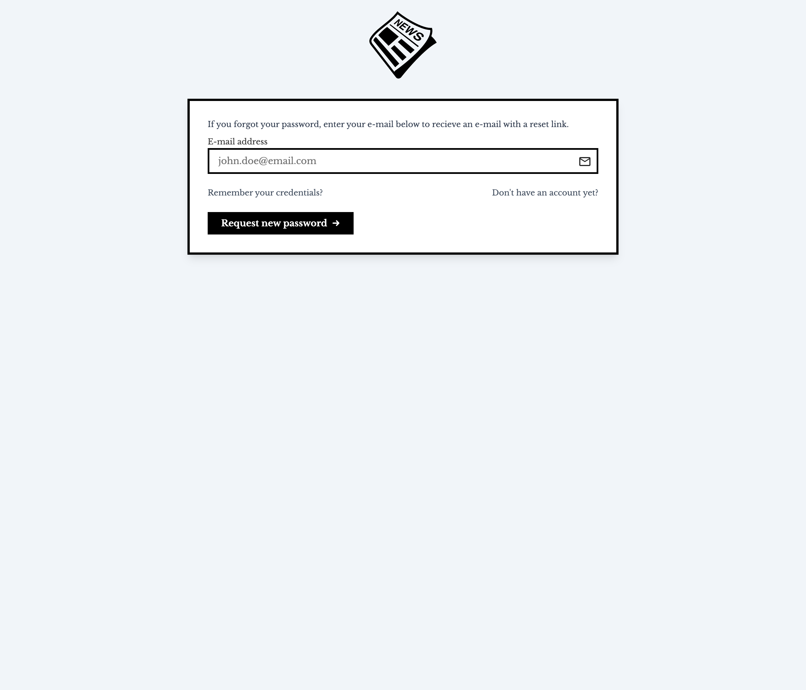
        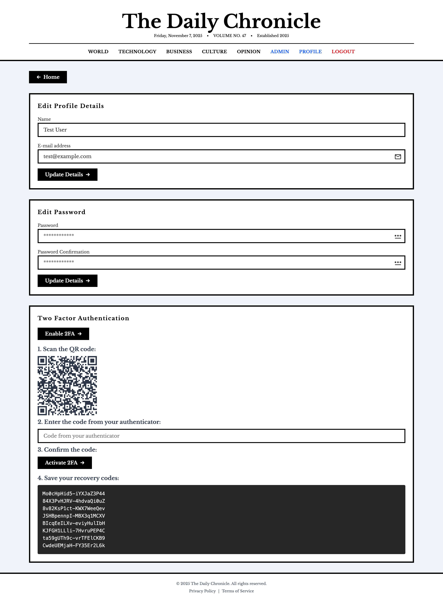
        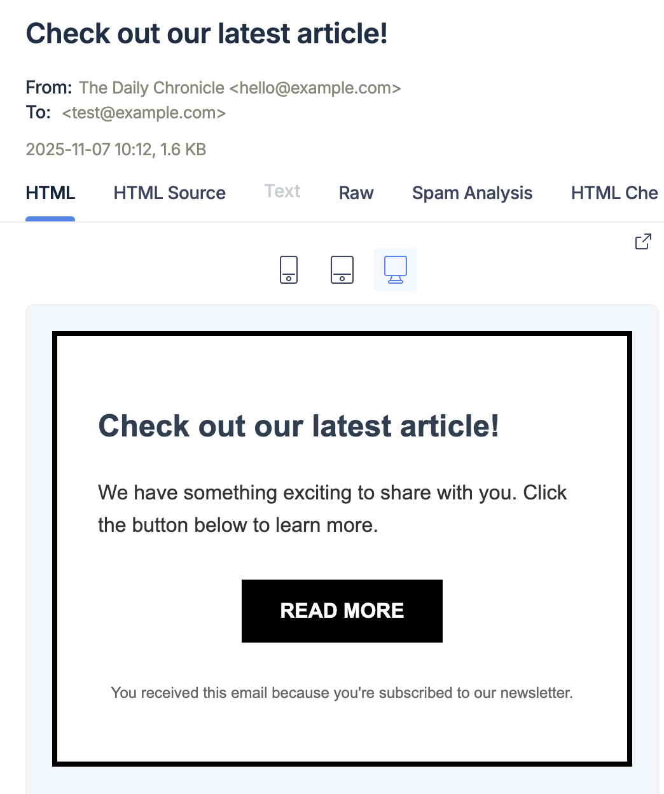
    </p>
    <p align="center">
        Home Page
    </p>
    <p align="center">
        
        
        
        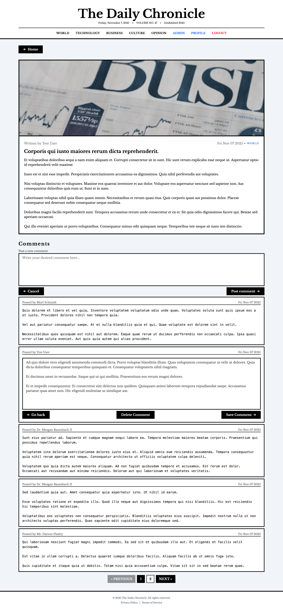>
    </p>
     <p align="center">
        Admin Panel
    </p>
    <p align="center">
        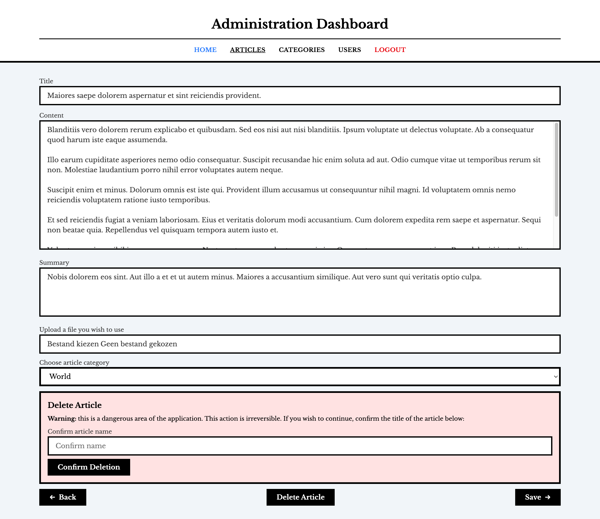
        
    </p>
    <p align="center">
        Admin Panel: Articles
    </p>
    <p align="center">
        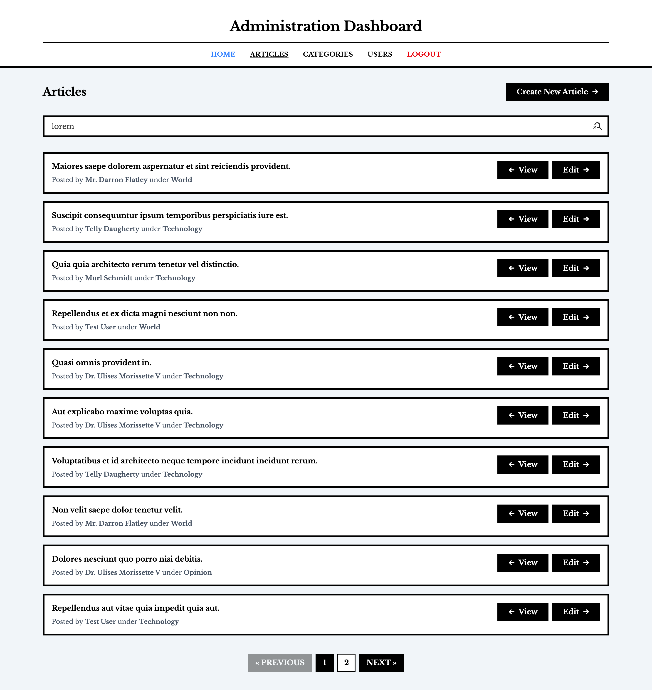
        
    </p>
    <p align="center">
        Admin Panel: Categories
    </p>
    <p align="center">
        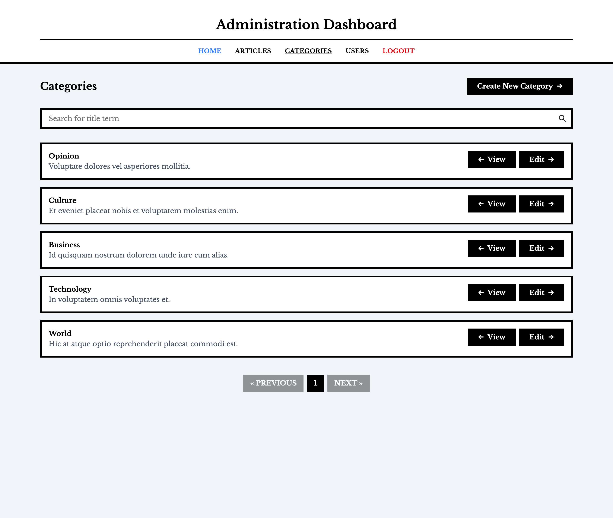
        
        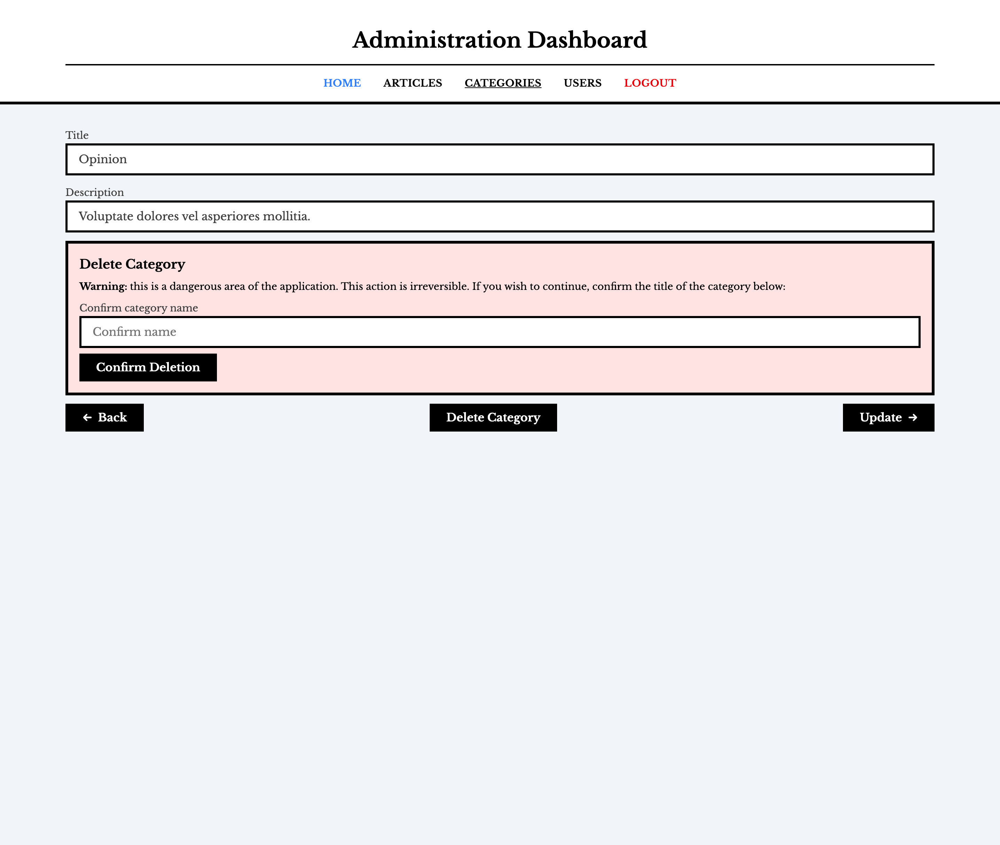
    </p>
    <p align="center">
        Admin Panel: Users
    </p>
    <p align="center">
        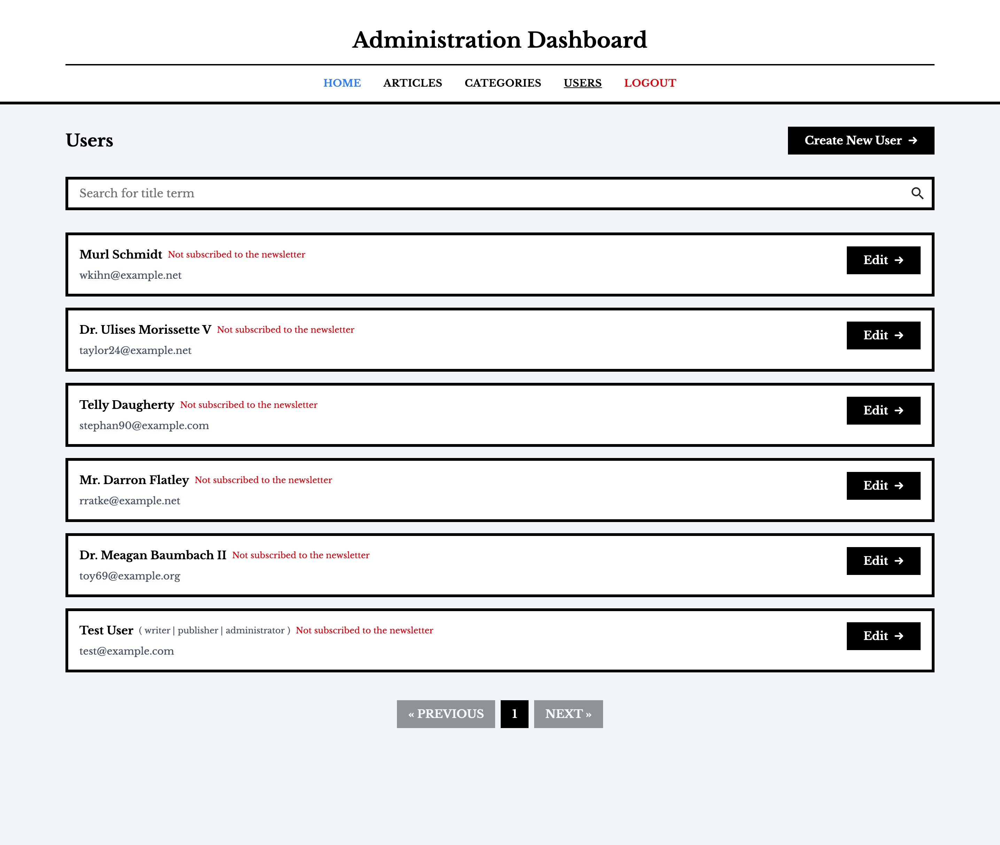
        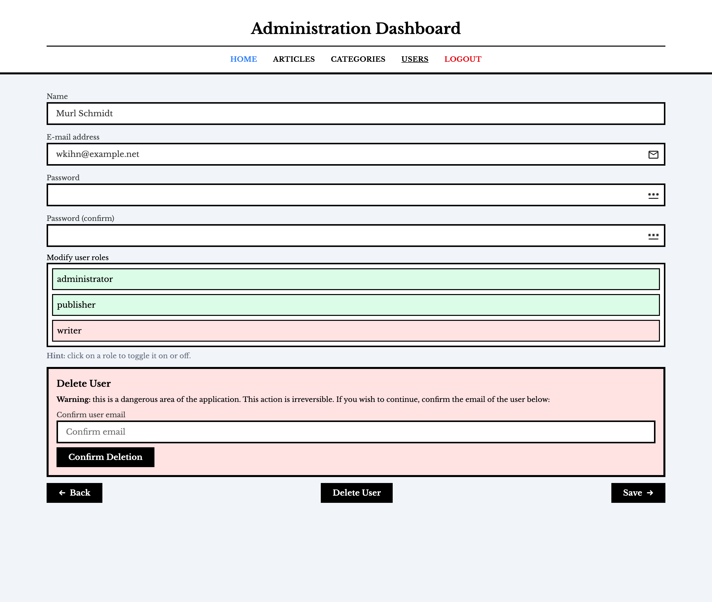
    </p>
</details>


## ✨ Features

### Authentication and authorization
 - Implemented Laravel fortify: authentication (including 2FA, password and email verification) + front end pages (see config/fortify.php)
 - Implemented a profile controller, built ontop of Laravel Fortify, to edit name, email, password and enable/disable 2FA.
 - Using Spatie's Laravel Permissions for roles (writer: articles, publisher: categories, admin: users)

### UI/UX
 - UI/UX remniscent of a classic newspaper, fully responsive and using the new view-transition API for browsing animations.
 - Homepage has a special newspaper-like design. Going beyond the homepage shows articles in a card.
 - Built using a mobile-first approach together using Tailwind 4 CSS's latest classes (size-x, divide-x, ...).


### Articles
 - Ability to create, edit or delete articles as a writer.
 - Ability to upload or modify header images for articles.
 - Ability to select a parent category (which is filterable on the homepage)

### Categories
 - Ability to create, edit or delete categories as a writer.
 - Categories dynamically get added to the navigation at the front page.

### User management
 - Ability to create, edit or delete users as an admin.
 - Shows whether the user is subscribed to the newsletter or not.
 - Shows all list with all of the roles an user has.
 - Ability to give roles to users dynamically (on create and on edit)

### Newsletters
 - Ability to subscribe or unsubscribe from newsletters
 - Newsletters are automatically sent when an article gets posted.
 - Users get a prompt on the main page to subscribe or unsubscribe at the end of the page.

 ### Miscellaneous
 - Search options and pagination across every page that shows a collection.
 - There is a designated admin panel that is only accessible if you have the correct roles.
    - The admin panel has a 1:1 design with the homepage, but minimalized for administration.
 - Navigation is built semi-dynamically from a conditional perspective.
 - Using Vue's naming conventions (AppX) and Breeze's partial conventions (/pages/route/Partial/x)